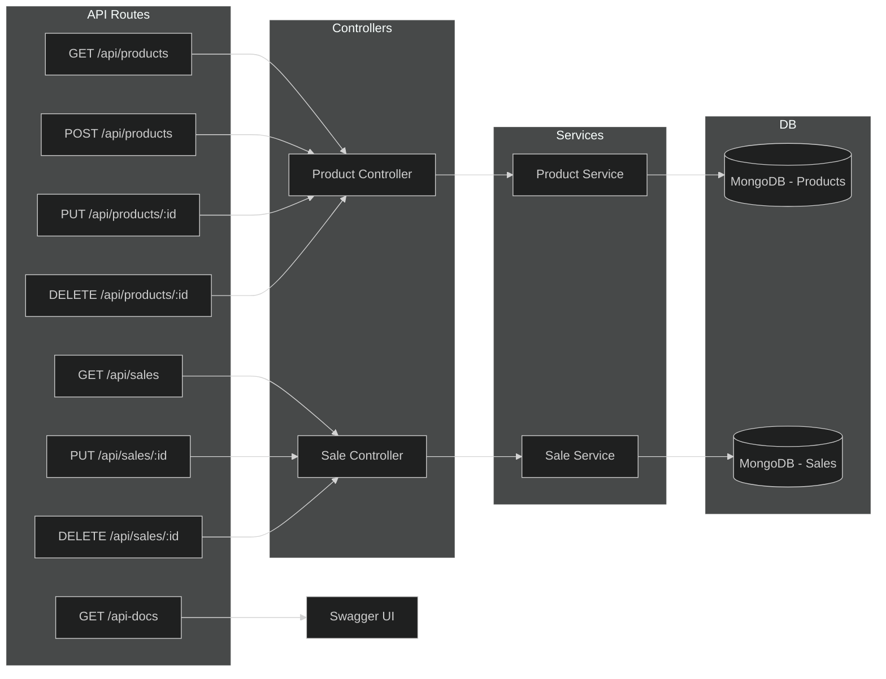

# 🧾 Simple POS API Architecture Diagram

```mermaid
%%{init: {'theme': 'dark'}}%%
graph LR

  %% Subgraphs arranged left to right
  subgraph API_Routes [API Routes]
    direction TB
    A1[GET /api/products]
    A2[POST /api/products]
    A3[PUT /api/products/:id]
    A4[DELETE /api/products/:id]
    B1[GET /api/sales]
    B3[PUT /api/sales/:id]
    B4[DELETE /api/sales/:id]
    C[GET /api-docs]
  end

  subgraph Controllers
    direction TB
    D1[Product Controller]
    D2[Sale Controller]
  end

  subgraph Services
    direction TB
    E1[Product Service]
    E2[Sale Service]
  end

  subgraph DB
    direction TB
    F1[(MongoDB - Products)]
    F2[(MongoDB - Sales)]
  end

  %% Connections from API Routes to Controllers
  A1 --> D1
  A2 --> D1
  A3 --> D1
  A4 --> D1

  B1 --> D2
  B3 --> D2
  B4 --> D2

  C --> SwaggerUI[Swagger UI]

  %% Controllers to Services
  D1 --> E1
  D2 --> E2

  %% Services to DB
  E1 --> F1
  E2 --> F2


```
