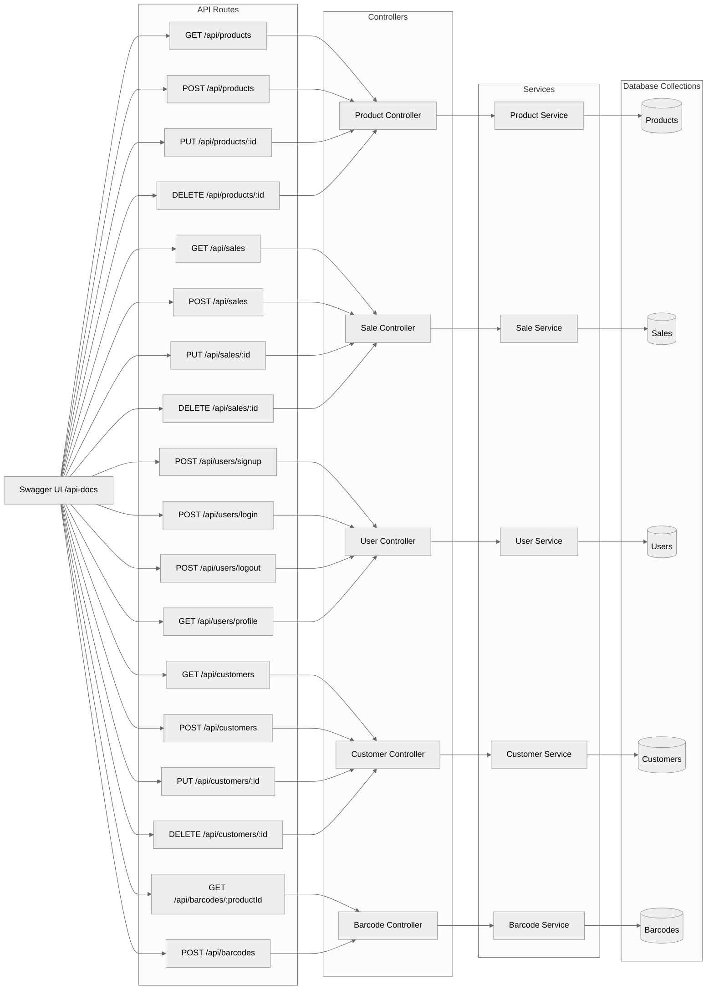

# 🧾 Store POS API Architecture Diagram

```mermaid
graph LR
  %%{ init: {'theme': 'neutral'}}%%
  %% Layout from Left to Right

  %% API Routes
  subgraph API_Routes["API Routes"]
    direction TB
    P1[GET /api/products]
    P2[POST /api/products]
    P3[PUT /api/products/:id]
    P4[DELETE /api/products/:id]

    S1[GET /api/sales]
    S2[POST /api/sales]
    S3[PUT /api/sales/:id]
    S4[DELETE /api/sales/:id]

    U1[POST /api/users/signup]
    U2[POST /api/users/login]
    U3[POST /api/users/logout]
    U4[GET /api/users/profile]

    C1[GET /api/customers]
    C2[POST /api/customers]
    C3[PUT /api/customers/:id]
    C4[DELETE /api/customers/:id]

    B1[GET /api/barcodes/:productId]
    B2[POST /api/barcodes]
  end

  %% Controllers
  subgraph Controllers["Controllers"]
    direction TB
    PC[Product Controller]
    SC[Sale Controller]
    UC[User Controller]
    CC[Customer Controller]
    BC[Barcode Controller]
  end

  %% Services
  subgraph Services["Services"]
    direction TB
    PS[Product Service]
    SS[Sale Service]
    US[User Service]
    CS[Customer Service]
    BS[Barcode Service]
  end

  %% DB Collections
  subgraph DB["Database Collections"]
    direction TB
    DBP[(Products)]
    DBS[(Sales)]
    DBU[(Users)]
    DBC[(Customers)]
    DBB[(Barcodes)]
  end

  %% Swagger Docs
  Swagger[Swagger UI /api-docs]

  %% Connections
  %% API -> Controllers
  P1 --> PC
  P2 --> PC
  P3 --> PC
  P4 --> PC

  S1 --> SC
  S2 --> SC
  S3 --> SC
  S4 --> SC

  U1 --> UC
  U2 --> UC
  U3 --> UC
  U4 --> UC

  C1 --> CC
  C2 --> CC
  C3 --> CC
  C4 --> CC

  B1 --> BC
  B2 --> BC

  %% Controllers -> Services
  PC --> PS
  SC --> SS
  UC --> US
  CC --> CS
  BC --> BS

  %% Services -> DB
  PS --> DBP
  SS --> DBS
  US --> DBU
  CS --> DBC
  BS --> DBB

  %% Swagger Docs linked to API routes
  Swagger --> P1
  Swagger --> P2
  Swagger --> P3
  Swagger --> P4
  Swagger --> S1
  Swagger --> S2
  Swagger --> S3
  Swagger --> S4
  Swagger --> U1
  Swagger --> U2
  Swagger --> U3
  Swagger --> U4
  Swagger --> C1
  Swagger --> C2
  Swagger --> C3
  Swagger --> C4
  Swagger --> B1
  Swagger --> B2

```
