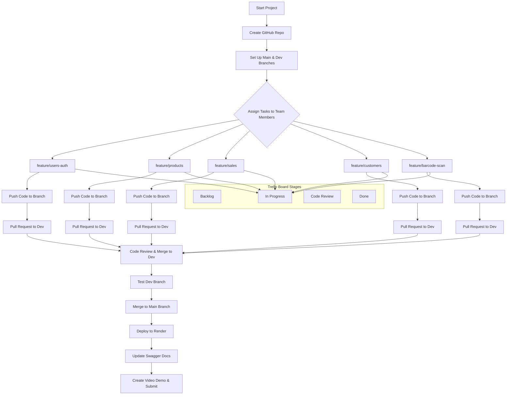

```mermaid
graph TB
%% Layout from Top to Bottom
  A[Start Project] --> B[Create GitHub Repo]
  B --> C[Set Up Main & Dev Branches]
  C --> D{Assign Tasks to Team Members}

  D --> D1[feature/users-auth]
  D --> D2[feature/products]
  D --> D3[feature/sales]
  D --> D4[feature/customers]
  D --> D5[feature/barcode-scan]

  D1 --> E1[Push Code to Branch]
  D2 --> E2[Push Code to Branch]
  D3 --> E3[Push Code to Branch]
  D4 --> E4[Push Code to Branch]
  D5 --> E5[Push Code to Branch]

  E1 --> F1[Pull Request to Dev]
  E2 --> F2[Pull Request to Dev]
  E3 --> F3[Pull Request to Dev]
  E4 --> F4[Pull Request to Dev]
  E5 --> F5[Pull Request to Dev]

  F1 --> G[Code Review & Merge to Dev]
  F2 --> G
  F3 --> G
  F4 --> G
  F5 --> G

  G --> H[Test Dev Branch]
  H --> I[Merge to Main Branch]
  I --> J[Deploy to Render]
  J --> K[Update Swagger Docs]
  K --> L[Create Video Demo & Submit]

  subgraph Trello [Trello Board Stages]
    T1[Backlog]
    T2[In Progress]
    T3[Code Review]
    T4[Done]
  end

  D1 --> T2
  D2 --> T2
  D3 --> T2
  D4 --> T2
  D5 --> T2
```
